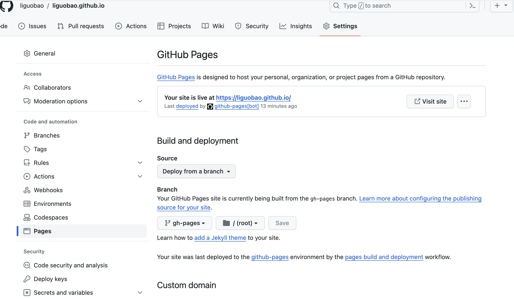

Official guide: Configuring a publishing source for your GitHub Pages site
https://docs.github.com/zh/pages/getting-started-with-github-pages/configuring-a-publishing-source-for-your-github-pages-site

Key point:

Set the correct repository branch for Pages.

If you use Hugo (or similar static site generators), they typically produce a `public` folder of static files.

With GitHub Actions, you build and publish those static files, usually to a dedicated branch of the repository.

## My Example

Repository:

- https://github.com/liguobao/liguobao.github.io

The default branch (master) contains my site config and content.

The static output branch is:

https://github.com/liguobao/liguobao.github.io/tree/gh-pages

Now go to GitHub project Settings → Pages and set “Your GitHub Pages site” to branch `gh-pages`.

Done.

> Photo by Pawel Czerwinski on Unsplash

